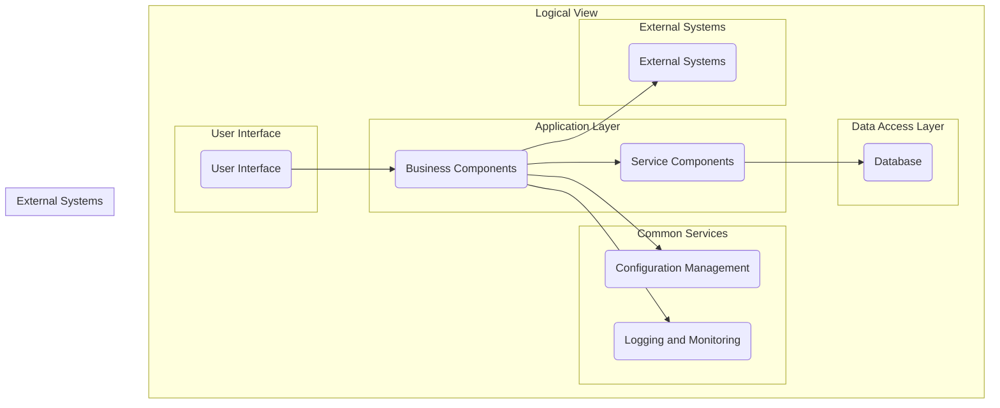

```mermaid
graph TD
  subgraph "Logical View"
    subgraph "User Interface"
      UI(User Interface)
    end

    subgraph "Application Layer"
      BC(Business Components)
      SC(Service Components)
    end

    subgraph "Data Access Layer"
      DB(Database)
    end

    subgraph "Common Services"
      CM(Configuration Management)
      LM(Logging and Monitoring)
    end

    subgraph "External Systems"
      ES(External Systems)
    end

    UI --> BC
    BC --> SC
    SC --> DB
    BC --> CM
    BC --> LM
    BC --> ES
  end
  
    subgraph "External Systems"
      ES(External Systems)
    end
```

  
